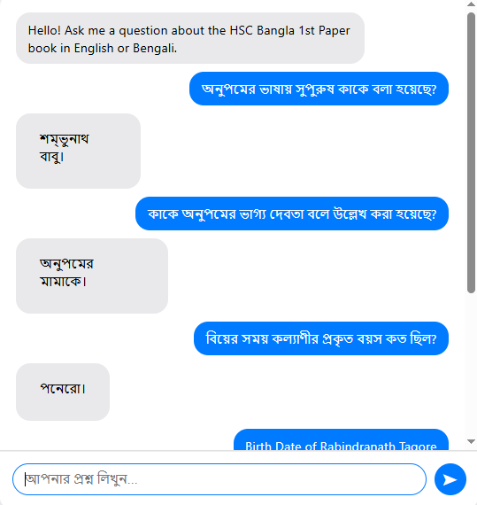
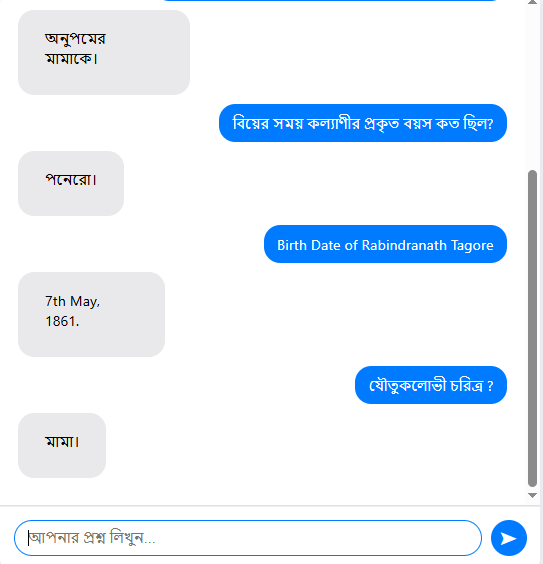

# Bengali Textbook RAG Chatbot

A conversational AI chatbot that uses Retrieval-Augmented Generation (RAG) to answer questions about the "HSC Bangla 1st Paper" textbook. The application is built with FastAPI, LangChain, and Google's Gemini Pro model.

## Screenshots

Make sure your screenshot files are named `screenshot1.png` and `screenshot2.png` and are placed inside the `SS` folder.

| Chat Interface | Another View |
| :---: | :---: |
|  |  |

## 📖 About The Project

This project provides an interactive chat interface allowing users to ask specific questions about a Bengali textbook. Instead of relying on pre-trained knowledge, it uses the RAG technique to retrieve relevant passages directly from the source PDF, which are then used by a Large Language Model (LLM) to generate accurate, context-aware answers.

This approach ensures that the chatbot's knowledge is strictly limited to the provided document, making it a reliable tool for study and reference.

### Key Features

* **Interactive Chat UI:** A clean, modern front-end built with HTML and vanilla JavaScript.
* **PDF Text Extraction:** Automatically processes the source PDF using Tesseract OCR on the first run.
* **Advanced Retrieval:** Implements LangChain's `ParentDocumentRetriever` and `MultiQueryRetriever` for more accurate context fetching.
* **Conversational Memory:** Remembers the last few turns of the conversation to answer follow-up questions.
* **Bilingual Support:** Can understand questions and provide answers in both Bengali and English.

### 🛠️ Tech Stack

* **Backend:** Python, FastAPI
* **AI/ML:** LangChain, Google Gemini, HuggingFace Embeddings
* **Vector Store:** FAISS (Facebook AI Similarity Search)
* **OCR & PDF:** Tesseract, PyMuPDF
* **Frontend:** HTML, CSS, JavaScript

### Prerequisites

Please install these in your system:


* **Tesseract-OCR Engine**
    * This is a system-level dependency, not a Python package. Your Python code depends on it to perform OCR.
    * [Tesseract Installation Guide]([https://tesseract-ocr.github.io/tessdoc/Installation.html](https://github.com/tesseract-ocr/tesseract.git))
    * On Windows, make sure to note the installation path. The code currently points to `C:\Program Files\Tesseract-OCR\tesseract.exe`. If your path is different, update the `TESSERACT_CMD_PATH` variable in `main.py`.

### Installation and Setup

1.  **Clone the Repository**
    ```sh
    git clone https://github.com/KZ1R2N/RAG-BOT.git
    
    ```

2.  **Create and Activate a Virtual Environment**
    * On Windows:
        ```sh
        python -m venv venv
        venv/scripts/activate  - Powershell
        ```
    * On macOS/Linux:
        ```sh
        python3 -m venv venv
        source venv/bin/activate
        ```

3.  **Install Python Dependencies**
    ```sh
    pip install -r requirements.txt
    ```

4.  **Set Up Environment Variables**
    * Create a file named `.env` in the root of the project.
    * Add your Google API key to this file:
        ```
        GOOGLE_API_KEY="your_google_api_key_here"
        ```

5.  **Add the Source Document**
    * Place your PDF file, `HSC26-Bangla1st-Paper.pdf`, in the root directory of the project. Already added in the repository. 

##  Usage

1.  **Run the FastAPI Server**
    ```sh
    uvicorn main:app --reload
    ```
    * **First Run Note:** The very first time you start the server, it will begin the OCR process to read the PDF and create `extracted_output.txt`. This is a one-time setup and may take several minutes depending on your computer's speed and the PDF's length. You can monitor the progress in your terminal.

2.  **Open the Chatbot**
    * Once the server is running and the message "🚀 RAG Pipeline with Multi-Query is Ready!" appears, open your web browser and navigate to:
    * [http://127.0.0.1:8000](http://127.0.0.1:8000)

You can now start asking questions about the textbook!


Here I've another project for reference which I had worked on long time ago. Here you can upload any pdf and based on that pdf the chat bot will answer. But that was not made perticularly Bangla in head. 

https://github.com/KZ1R2N/Chat-Pdf.git


Please feel free to contact me if any issue regarding the project. 
